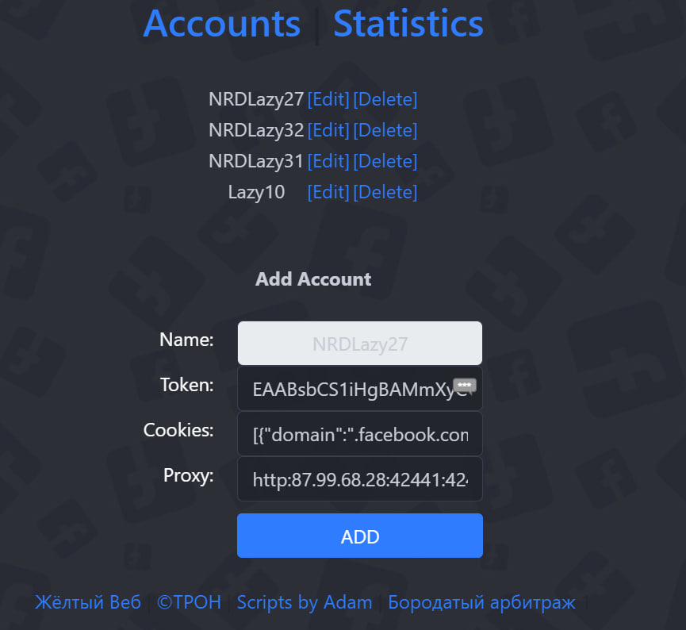
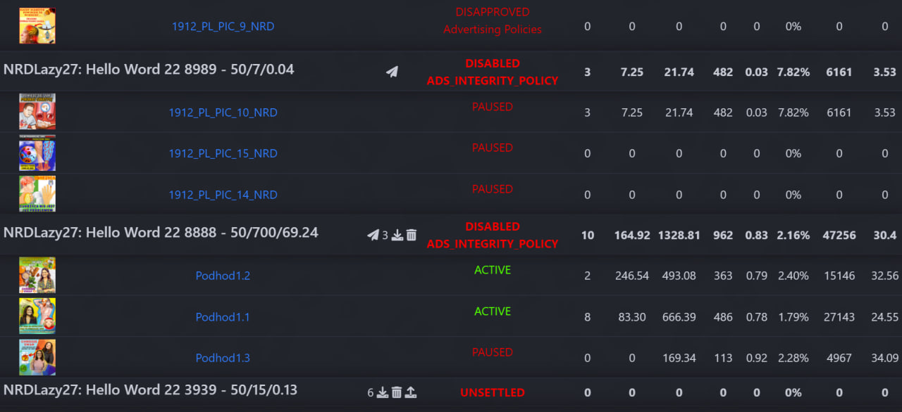

# ReMask

Lightweight tool to check statistics of multiple Facebook ad accounts at once.
Can show stats for:
- single account or all accounts
- only active accounts or all
- various date ranges: today, yesterday and so on

For Ad Account the following is displayed: 
- Account Name and Id
- Spend limit, Current billing and Unbilled spend
- Account Status and Disable Reason
- Pixel Id
- Total Statistics for all ads

For each Ad in the account the following is displayed: 
- Creative
- Name with the Link
- Status with Review Feedback
- Results count

The following Actions are allowed:
- Start/Stop ads; 
- Download/Upload autorules from/to ad accounts;
- Send DISAPPROVE appeals 
- Send POLICY appeals 
- Pay UNSETTLED accounts

# Requirements
PHP 8.2 or newer
# Installation
Copy-Paste all the files to the ROOT folder of your domain, open settings.php and edit your password there. 

Then go to http://yourdomain.com?password=yourpassword and enjoy!
## Donate 
If you like this software, please donate!

**USDT TRC20** TKeNEVndhPSKXuYmpEwF4fVtWUvfCnWmra
## Code
https://t.me/yellow_web
## Design
https://t.me/bearded_cpa
## Original idea
https://t.me/tron_cpa

https://t.me/adamusfb

